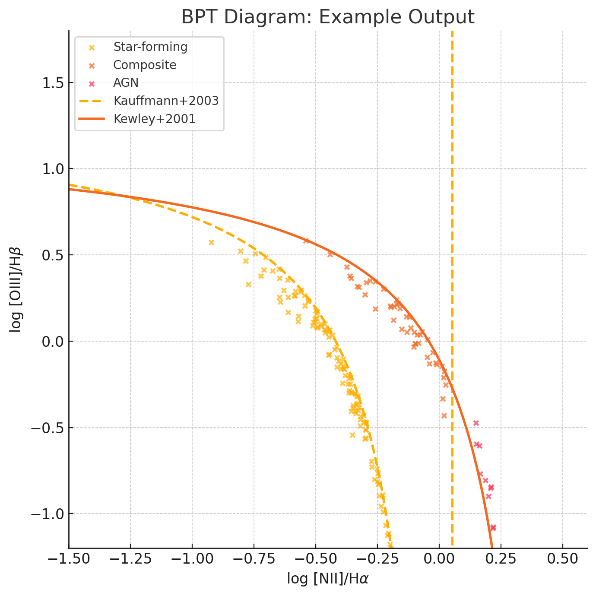

# AGN Classifier with BPT Diagrams

This repository contains a small Python tool to query the Sloan Digital Sky Survey (SDSS),
classify galaxies using [Baldwin-Phillips-Terlevich (BPT)] diagrams and
visualize the result.



## Scientific Context
The hardness of a galaxy's ionizing radiation reveals whether its emission is
powered by young stars or by an active galactic nucleus (AGN). BPT diagrams plot
ratios of strong optical emission lines to disentangle these scenarios.
This project uses the empirical separation from **Kauffmann et al. (2003)** and
the theoretical maximum starburst line from **Kewley et al. (2001)** to label
galaxies as *Star-Forming*, *Composite* or *AGN*.

## How It Works
1. **Query SDSS** – A SQL query retrieves emission line fluxes from the MPA-JHU
   catalog (SDSS DR8). Internet access is required for this step.
2. **Process Data** – Pandas computes the relevant line ratios on a logarithmic
   scale.
3. **Classify Galaxies** – Each object is compared to the Kauffmann and Kewley
   curves to determine its ionization source.
4. **Visualize** – Matplotlib and seaborn generate a density plot with the
   demarcation lines annotated.

## Quick Start
```bash
# Clone and enter the repository
git clone <your-repo-url>
cd <your-repo-directory>

# (Optional) create a virtual environment
python -m venv venv
source venv/bin/activate  # On Windows use venv\Scripts\activate

# Install dependencies
pip install -r requirements.txt

# Run the classifier (requires internet access)
python bpt_classifier.py
```
The resulting plot is saved as `BPT_Diagram.png` in the repository root.

## Future Work
- Include additional BPT diagnostics ([S II] and [O I]).
- Explore machine learning approaches for automated classification.
- Investigate redshift evolution and host galaxy correlations.
