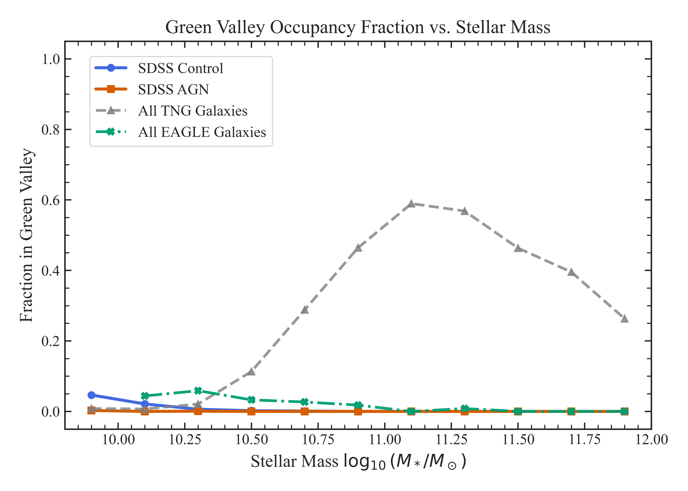
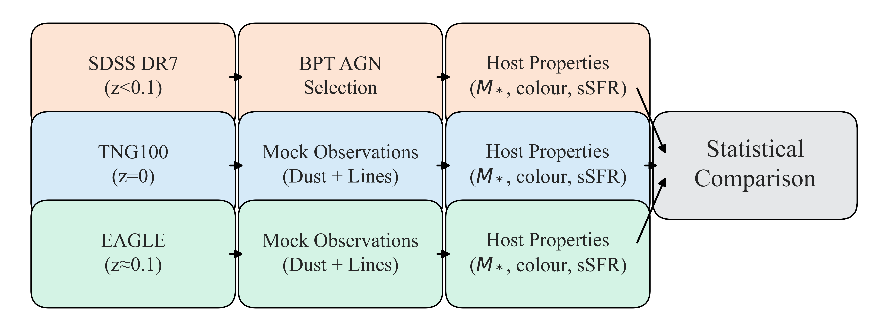
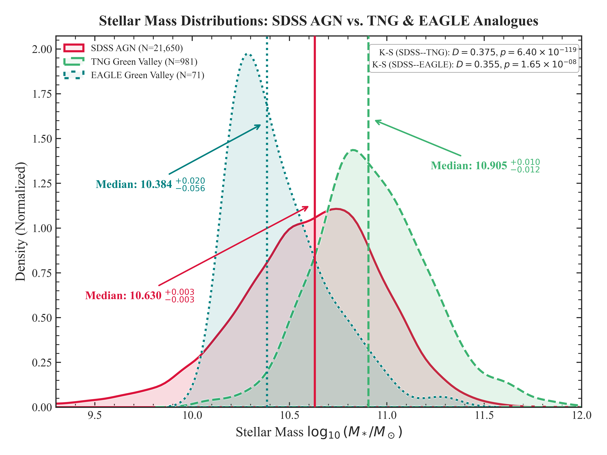

# 🌌 Quenching in the Green Valley: SDSS vs. IllustrisTNG & EAGLE

**A reproducible, open-science benchmark for AGN host galaxy quenching in cosmological simulations and SDSS observations.**

[](LICENSE)

---

## 🚀 Project Overview

**Can state-of-the-art simulations actually match the real universe when it comes to AGN host galaxies in the "green valley"?**  
This repo hosts all code, processed data, and figures for the paper:

> **"Quenching in the Green Valley at Low Redshift: A Comparative Analysis of AGN Host Galaxies in SDSS, IllustrisTNG and EAGLE"**  
> Gaurav Gawade (submitted. MNRAS, 2025)

We pit 21,649 real AGN hosts from SDSS DR7 against simulated analogues in IllustrisTNG-100 and EAGLE.  
Spoiler: **the simulations don't agree with the universe, and it's not even close.** Want details? Dive into the manuscript!

---

## 🏆 Why Should You Care?

- **Massive sSFR mismatch:** IllustrisTNG "green-valley" galaxies are over-quenched by up to 5.3 dex (!), while EAGLE galaxies are under-quenched by ~1.1 dex.
- **Simulation overproduction:** TNG overpopulates the green valley by almost an order of magnitude.
- **No cherry-picking:** Everything—selection, statistics, figures—is fully reproducible.
- **All data and code are open.** If you want to test, tweak, or expand, this is your launchpad.

Read the full story and the caveats (we're honest!) in [`paper/paper_link`](paper/paper_link).

---

## 🗂 Repository Structure

- `master_notebook.ipynb` — Main Jupyter notebook: data, analysis, plots
- `environment.yml` — Conda environment for reproducibility
- `requirements.txt` — Python dependencies (pip)
- `data/` — Input catalogs (user-downloaded from SDSS/TNG/EAGLE)
- `outputs/figures/` — All generated plots (.png)
- `paper/paper_draft.pdf` — Full manuscript (read this!)
- `docs/` — (Optional) supplementary documentation


---

## 📊 Figures (from `outputs/figures/`)

> *All PDFs converted to .png for proper display here!*

- **Colour–mass plane & sSFR KDE**  
  `fig1_colour_mass.png`  
  

- **sSFR–mass relation**  
  `fig2_ssfr_mass.png`  
  

- **Cumulative distributions: stellar mass & sSFR**  
  `fig3_cdf.png`  
  

- **Green valley occupancy fraction**  
  `fig4_gv_frac.png`  
  

- **Sensitivity of sSFR gap to colour cut**  
  `fig5_percentile_sweep.png`  
  

- **Bootstrap KS distributions**  
  `fig6_bootstrap_KS.png`  
  

- **Mock BPT diagram for simulated analogues**  
  `fig7_BPT_mock.png`  
  

- **Analysis pipeline flowchart**  
  `fig8_flowchart.png`  
  

- **Appendix: SDSS BPT**  
  `figure_A1_BPT_Diagram_SDSS.png`  
  

- **Appendix: Green valley in TNG/EAGLE**  
  `figure_A2_TNG_GV_Definition.png`  
  

- **Appendix: Stellar mass KDEs**  
  `figure_A3_mass_comparison.png`  
  


---

## 💻 How to Run This Project

1. **Clone the repo and set up the environment:**
    ```
    git clone https://github.com/TshapedAsh/Green-Valley-AGN-SDSS-TNG.git
    cd Green-Valley-AGN-SDSS-TNG
    conda env create -f environment.yml
    conda activate green-valley-env
    ```
    or use pip:
    ```
    pip install -r requirements.txt
    ```

2. **Download required data:**

Place these files in the `data/` directory:

- **SDSS DR7 (MPA-JHU Value-Added Catalogues)**  
  Download these files from the [MPA-JHU SDSS DR7 Data Archive](https://wwwmpa.mpa-garching.mpg.de/SDSS/DR7/Data/) and place in the `data/` directory:
  - `gal_info_dr7_v5_2.fit`
  - `totlgm_dr7_v5_2b.fit`
  - `gal_totsfr_dr7_v5_2.fits`
  - `gal_line_dr7_v5_2.fit`


- **IllustrisTNG100-1**
  - `aperture_masses.hdf5` (stellar mass, 30 kpc aperture, snapshot 99)
  - `stellar_photometry.99.hdf5` (dust-free synthetic photometry, snapshot 99)
  - All `groupcat-99.*.hdf5` files (full group catalogs for SFR and centrals, snapshot 99; expect ~448 files)
  
  Download these from: [TNG100-1 Data Portal](https://www.tng-project.org/data/downloads/TNG100-1/) . Login required.
  and place in the `data/` directory.


- **EAGLE Ref-L0100N1504**  
  - `EAGLE_data.csv` (produced by running the SQL query in `data/eagle_query.sql`)

  To generate this file:
  1. Go to the [EAGLE SQL interface](http://virgodb.dur.ac.uk:8080/Eagle/) Login required.
  2. Open the SQL query stored in [`data/eagle_query.sql`](data/eagle_query.sql) from this repository.
  3. Run the query and export the results as `EAGLE_data.csv`.
  4. Place the file in the `data/` folder.

  *(Your `EAGLE_data.csv` will include all required columns: GalaxyID, StellarMass, SFR, u_nodust, g_nodust, r_nodust, i_nodust, z_nodust, BlackHoleMass, BlackHoleMassAccretionRate, SubGroupNumber, SnapNum.)*


3. **Run the notebook:**
    ```
    jupyter notebook master_notebook.ipynb
    ```
    - All figures and stats will be regenerated and saved to `outputs/figures/`.
    - Every analysis step is documented inline with the code.

---

## 📚 More Information

- **All main results, methodology, and caveats are explained in detail in [`paper/paper_link`](paper/paper_link).**
- For full transparency, see appendix and all code logic in the notebook.

---

## 📜 Citation

If you use this code, data, or findings, please cite:

@article{Gawade2025,
author = {Gaurav Gawade},
title = {Quenching in the Green Valley at Low Redshift: A Comparative Analysis of AGN Host Galaxies in SDSS, IllustrisTNG and EAGLE},
journal = {xyz},
year = {2025},
volume = {xxx},
pages = {yyy--zzz},
doi = {xxx} 
}


And our open data/software release:
Gawade, Gaurav. (2025). Green-Valley-AGN-SDSS-TNG [Data set]. Zenodo. https://doi.org/10.5281/zenodo.XXXXXXX


---

## 📬 Contact

**Gaurav Gawade**  
[gauravgawade@proton.me](mailto:gauravgawade@proton.me)

---

## ⚖️ License

MIT License – Open for reuse, remix, and cosmic criticism.

---

## 🚦 Open Science Statement

All data, code, and outputs are public, reproducible, and transparent.  
We welcome honest criticism, new ideas, and community forks—help us make galaxy evolution science better!

**Read the full manuscript for the real scientific discussion, all caveats, and next steps—this README is just the "movie trailer" for your curiosity!**


## 🙏 Acknowledgements

This github repository benefited from the use of AI-assisted tools—including large language models—for code review, figure captioning and data troubleshooting.  
The author gratefully acknowledges these technologies as accelerators of the astrophysical research, while affirming that all research decisions, data interpretations, and conclusions presented here are the sole responsibility of the author.

Special thanks to the open-source platforms:
- **GitHub**, for collaborative code hosting and version control.
- **Zenodo**, for long-term archival and open sharing of scientific data and software.

The combination of open-source infrastructure and responsible AI usage was key to making this repository fully transparent and accessible.
