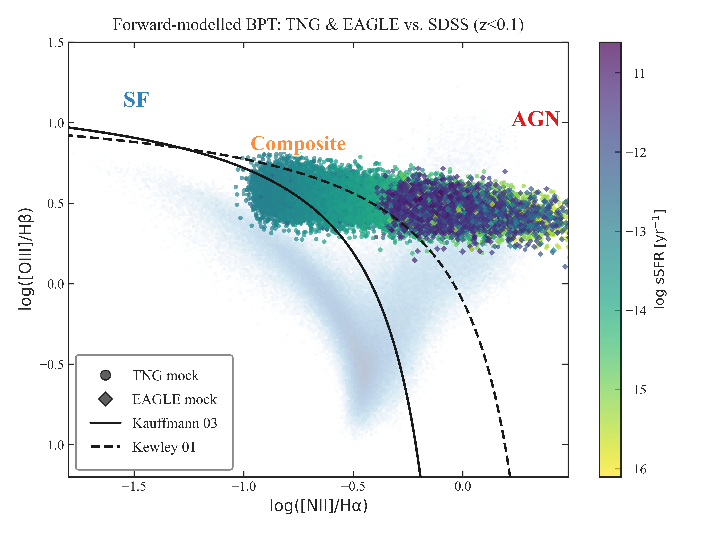

Crystal clear! Here is your **entire README.md** in a single markdown code block, with no breaks, fully ready to copy-paste.
All structure and hype, but short enough to be practical, and designed to encourage readers to open the actual paper for details.
**Just replace any `XXXXXXX` with your real Zenodo DOI.**
*Assumes you’ll convert all figure PDFs to PNG for GitHub previews.*

---

```markdown
# 🌌 Quenching in the Green Valley: SDSS vs. IllustrisTNG & EAGLE

A fully reproducible, open-science benchmark for AGN host galaxy quenching in simulations and observations.

---

## 🚀 Project Overview

Can modern simulations actually match the real universe when it comes to AGN host galaxies in the "green valley"?  
This repo hosts all code, processed data, and figures for:

> **Quenching in the Green Valley at Low Redshift: A Comparative Analysis of AGN Host Galaxies in SDSS, IllustrisTNG and EAGLE**  
> *Gaurav Gawade (MNRAS, 2025)*

We pit 21,649 real AGN hosts from SDSS DR7 against simulated analogues in IllustrisTNG-100 and EAGLE.  
Spoiler: **the simulations don’t agree with the universe, and it’s not even close.** For full results, see the manuscript!

---

## 🏆 Highlights

- **Huge sSFR mismatch:** TNG “green-valley” galaxies are over-quenched by up to 5.3 dex; EAGLE galaxies are under-quenched by ~1.1 dex.
- **Simulation overproduction:** TNG overpopulates the green valley by nearly an order of magnitude.
- **Zero hand-waving:** All sample selection, statistics, and figures are fully reproducible.
- **All code, all data, all open.** If you want to test, tweak, or extend—this is your launchpad.

Read the full science story, caveats, and implications in [`paper/paper_draft.pdf`](paper/paper_draft.pdf).

---

## 🗂 Repository Structure

```

Green-Valley-AGN-SDSS-TNG/
├── master\_notebook.ipynb      # Main Jupyter notebook (analysis/figures)
├── environment.yml            # Conda environment for reproducibility
├── requirements.txt           # Python pip dependencies
├── data/                      # (User-downloaded) input catalogs (see below)
├── outputs/
│   └── figures/               # All generated plots (.png)
├── paper/
│   └── paper\_draft.pdf        # Full manuscript (read this!)
└── docs/                      # (Optional) supplementary docs

````

---

## 📊 Figures (see `outputs/figures/`)

> *PDFs don’t display inline on GitHub. Convert all main figure PDFs to PNG for readme previews!*

- `fig1_colour_mass.png` – Colour–mass plane & sSFR KDE  
  
- `fig4_gv_frac.png` – Green valley occupancy fraction  
  
- `fig7_BPT_mock.png` – Forward-modelled BPT diagram  
  
- All other figures: see `outputs/figures/` and the notebook.

---

## 💻 How to Run/Reproduce

1. **Clone and set up environment:**
    ```bash
    git clone https://github.com/TshapedAsh/Green-Valley-AGN-SDSS-TNG.git
    cd Green-Valley-AGN-SDSS-TNG
    conda env create -f environment.yml
    conda activate green-valley-env
    ```
    *Or* use pip:
    ```bash
    pip install -r requirements.txt
    ```

2. **Download data:**
    - [SDSS DR7](https://wwwmpa.mpa-garching.mpg.de/SDSS/DR7/Data/)
    - [IllustrisTNG100-1](https://www.tng-project.org/data/downloads/TNG100-1/)
    - [EAGLE Ref-L0100N1504](http://virgodb.dur.ac.uk:8080/Eagle/)
    - Place files in the `data/` directory. See the notebook for exact file names.

3. **Run the notebook:**
    ```bash
    jupyter notebook master_notebook.ipynb
    ```
    - Figures will be generated in `outputs/figures/`.

---

## 📚 Want the full story?

All methods, caveats, references, and results are explained in [`paper/paper_draft.pdf`](paper/paper_draft.pdf).  
This README is just a teaser—read the paper for all scientific details.

---

## 📜 Citation

If you use this work, please cite:

```bibtex
@article{Gawade2025,
  author = {Gaurav Gawade},
  title = {Quenching in the Green Valley at Low Redshift: A Comparative Analysis of AGN Host Galaxies in SDSS, IllustrisTNG and EAGLE},
  journal = {MNRAS},
  year = {2025},
  volume = {xxx},
  pages = {yyy--zzz},
  doi = {10.1093/mnras/xxxxx} % update after acceptance
}
````

And the data/software release:

```
Gawade, Gaurav. (2025). Green-Valley-AGN-SDSS-TNG [Data set]. Zenodo. https://doi.org/10.5281/zenodo.XXXXXXX
```

---

## 📬 Contact

Gaurav Gawade
[gauravgawade@proton.me](mailto:gauravgawade@proton.me)

---

## ⚖️ License

MIT License — open to use, adapt, or criticize!

---

**Open science means full transparency, reproducibility, and (sometimes) surprising simulation failures.
Want to help fix them? Fork this repo or get in touch!**

```

---

**Copy the entire block above for your README.md. No breaks, no missing content! Let me know if you want a super-short or super-long version, or want even more hype.**
```
