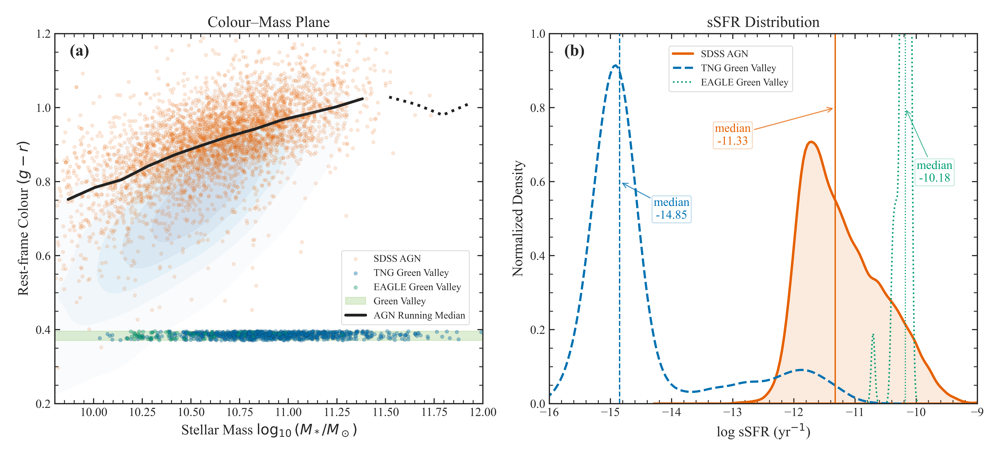
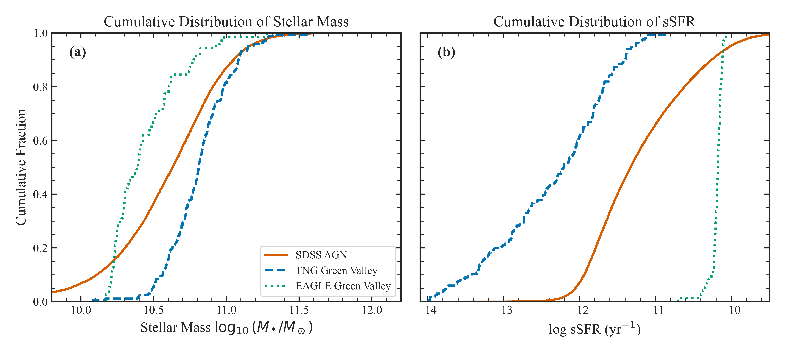
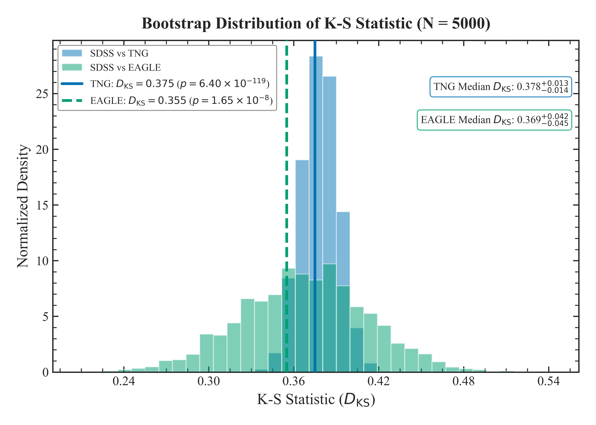

# 🌌 Quenching in the Green Valley: SDSS vs. IllustrisTNG & EAGLE

**A reproducible, open-science benchmark for AGN host galaxy quenching in cosmological simulations and SDSS observations.**

[](LICENSE)

---

## 🚀 Project Overview

**Can state-of-the-art simulations actually match the real universe when it comes to AGN host galaxies evolving through the “green valley”?**

This repository hosts all the code, analysis pipeline, and figures for the paper:

> **“Quenching pathways in the green valley at low redshift: confronting SDSS AGN hosts with IllustrisTNG and EAGLE”**  
> *Gaurav Gawade (MNRAS – submitted, 2025)*

We compare ≃ **19,000 BPT-selected pure AGN hosts** from **SDSS DR7** (z < 0.1) to **massive central galaxies** from **IllustrisTNG100-1** and **EAGLE Ref-L0100N1504**, using a **percentile-based green-valley definition** (75th–95th percentiles of *g–r* colour) applied *internally* within each dataset. This avoids dust and calibration systematics while directly testing how simulations populate transitional star-forming regimes.

---

## 🏆 Why This Matters

- **IllustrisTNG is almost fully quenched in its “green valley”:**  
  TNG100 centrals sit near **log sSFR ≃ −14.8**, roughly **3.5 dex below** SDSS AGN hosts (≈ −11.4).  
  This is not a gentle transition — it is a floor.

- **EAGLE is much closer to the observed universe:**  
  EAGLE green-valley centrals have **log sSFR ≃ −11.7**, only **0.3–0.4 dex** below SDSS AGN hosts, with a broad distribution spanning both star-forming and quenched systems.

- **Green-valley occupancy differs radically:**  
  At stellar masses around log₁₀(M\*/M☉) ≈ 11:  
  - SDSS AGN hosts: **~50–60%**  
  - TNG100 centrals: **~60%**, but dominated by quenched systems  
  - EAGLE centrals: **~20–40%**, matching the observed distribution more closely

- **Only ~0.03% of SDSS AGN hosts fall in the TNG-defined GV colour range.**  
  This result directly supports the idea that **TNG’s kinetic AGN feedback quenches galaxies so abruptly** that they redden only *after* star formation is already gone.

- **Robust to selection tweaks:**  
  Changing the green-valley lower percentile (60–90%) barely affects the results.

- **Fully reproducible:**  
  The entire workflow runs through a single notebook with documented steps, fixed RNG seeds, and export of all paper-quality figures.

---

## 🗂 Repository Structure

- `master_notebook_tng_sdss_eagle.ipynb` — Main notebook containing all analysis, selections, statistics, and figure generation  
- `environment.yml` — Conda environment for full reproducibility  
- `requirements.txt` — Optional pip dependency list  
- `data/` — **User-downloaded** SDSS/TNG/EAGLE input catalogues (not included in the repo)  
- `outputs/figures/` — Publication-ready figures  
- `paper/` — Manuscript, including `paper_draft.pdf`  
- `CITATION.cff` — Canonical citation metadata  
- `LICENSE` — MIT open license  

---

## 📊 Figures (from `outputs/figures/`)

> *A preview of the main results — full explanations are in the manuscript.*

- **Colour–Mass Plane & sSFR Density**  
  `fig1_colour_mass.png`  
  

- **sSFR–Mass Comparison (SDSS vs TNG vs EAGLE)**  
  `fig2_ssfr_mass_2panel.png`  
  

- **Stellar Mass & sSFR CDFs**  
  `fig3_cdf.png`  
  

- **Green Valley Occupancy**  
  `fig4_gv_frac.png`  
  

- **Percentile Sweep Sensitivity Test**  
  `fig5_percentile_sweep.png`  
  

- **Bootstrap KS Distributions**  
  `fig6_bootstrap_KS.png`  
  

- **Forward-Modelled BPT for Simulated Analogues**  
  `fig7_BPT_mock.png`  
  

- **Analysis Pipeline Flowchart**  
  `fig8_flowchart.png`  
  

- **Appendix & Additional Results**  
  SDSS BPT, GV definitions, stellar mass KDEs, sSFR distributions, etc.

---

## 💻 How to Run the Project

### 1. Clone the repo and install the environment


git clone https://github.com/TshapedAsh/Green-Valley-AGN-SDSS-TNG.git
cd Green-Valley-AGN-SDSS-TNG

# Recommended
conda env create -f environment.yml
conda activate green-valley-env

# Optional
pip install -r requirements.txt


2. **Download required data:**

Place these files in the `data/` directory:

- **SDSS DR7 (MPA-JHU Value-Added Catalogues)**  
  Download these files from the [MPA-JHU SDSS DR7 Data Archive](https://wwwmpa.mpa-garching.mpg.de/SDSS/DR7/Data/) and place in the `data/` directory:
  - `gal_info_dr7_v5_2.fit`
  - `totlgm_dr7_v5_2b.fit`
  - `gal_totsfr_dr7_v5_2.fits`
  - `gal_line_dr7_v5_2.fit`


- **IllustrisTNG100-1**
  - `aperture_masses.hdf5` (stellar mass, 30 kpc aperture, snapshot 99)
  - `stellar_photometry.99.hdf5` (dust-free synthetic photometry, snapshot 99)
  - All `groupcat-99.*.hdf5` files (full group catalogs for SFR and centrals, snapshot 99; expect ~448 files)
  
  Download these from: [TNG100-1 Data Portal](https://www.tng-project.org/data/downloads/TNG100-1/) . Login required.
  and place in the `data/` directory.


- **EAGLE Ref-L0100N1504**  
  - `EAGLE_data.csv` (produced by running the SQL query in `data/eagle_query.sql`)

  To generate this file:
  1. Go to the [EAGLE SQL interface](http://virgodb.dur.ac.uk:8080/Eagle/) Login required.
  2. Open the SQL query stored in [`data/eagle_query.sql`](data/eagle_query.sql) from this repository.
  3. Run the query and export the results as `EAGLE_data.csv`.
  4. Place the file in the `data/` folder.

  *(Your `EAGLE_data.csv` will include all required columns: GalaxyID, StellarMass, SFR, u_nodust, g_nodust, r_nodust, i_nodust, z_nodust, BlackHoleMass, BlackHoleMassAccretionRate, SubGroupNumber, SnapNum.)*


3. **Run the notebook:**
    ```
    jupyter notebook master_notebook_tng_sdss_eagle.ipynb
    ```
    - All figures and stats will be regenerated and saved to `outputs/figures/`.
    - Every analysis step is documented inline with the code.

---

## 📚 More Information

- **All main results, methodology, and caveats are explained in detail in [`paper/paper_link`](paper/paper_link).**
- For full transparency, see appendix and all code logic in the notebook.

---

## 📜 Citation

If you use this code, data, or findings, **please see [`CITATION.cff`](CITATION.cff) for the current citation format and preferred references** (including the Zenodo DOI and manuscript, when available).

**Quick BibTeX example (update fields when your paper/Zenodo record is public):**

```bibtex
@article{Gawade2025,
  author  = {Gaurav Gawade},
  title   = {Quenching pathways in the green valley at low redshift: confronting SDSS AGN hosts with IllustrisTNG and EAGLE},
  journal = {To appear},
  year    = {2025},
  doi     = {10.5281/zenodo.17872418}
}

```

And our open data/software release:
Gawade, Gaurav. (2025). Green-Valley-AGN-SDSS-TNG [Data set]. Zenodo. https://doi.org/10.5281/zenodo.17872418


---

## 📬 Contact

**Gaurav Gawade**  
[gauravgawade@proton.me](mailto:gauravgawade@proton.me)

---

## ⚖️ License

MIT License – Open for reuse, remix, and cosmic criticism.

---

## 🚦 Open Science Statement

All data, code, and outputs are public, reproducible, and transparent.  
We welcome honest criticism, new ideas, and community forks—help us make galaxy evolution science better!

**Read the full manuscript for the real scientific discussion, all caveats, and next steps—this README is just the "movie trailer" for your curiosity!**


## 🌟 Acknowledgements

This github repository benefited from the use of AI-assisted tools—including large language models—for code review and data troubleshooting.  
The author gratefully acknowledges these technologies as accelerators of the astrophysical research, while affirming that all research decisions, data interpretations, and conclusions presented here are the sole responsibility of the author.

Special thanks to the open-source platforms:
- **GitHub**, for collaborative code hosting and version control.
- **Zenodo**, for long-term archival and open sharing of scientific data and software.

The combination of open-source infrastructure and responsible AI usage was key to making this repository fully transparent and accessible.
